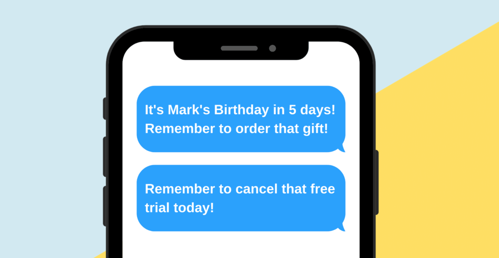

# Memory Pal

## Description
Memory Pal is a site to create simple text message reminders for upcoming events. Its focus is on setting up multiple timed reminders up to a month in advance. Text reminders may help users remember to order gifts in advance for recurring events like birthdays or anniversaries and remember to cancel subscriptions. 

The site is built with React and a serverless framework of AWS lambda functions written in python. User and event data is stored and accessed via a SQL database.  

## Usage

[Memory Pal](https://memorypal.netlify.app/)

## Acknowledgements
The site uses the [Twilio API](https://www.twilio.com/sms) to send text messages. 

## Questions
Github profile: [dgtlctzn](https://github.com/dgtlctzn)

If you have any questions about the project please contact josephperry720@gmail.com
## License
This project is covered under the GNU license

